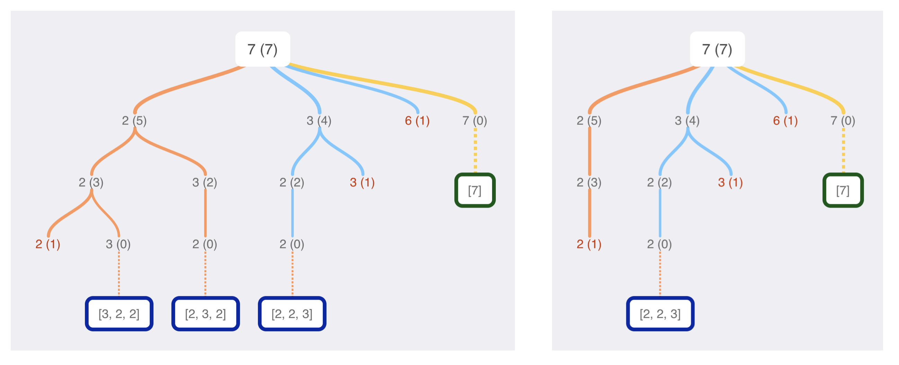
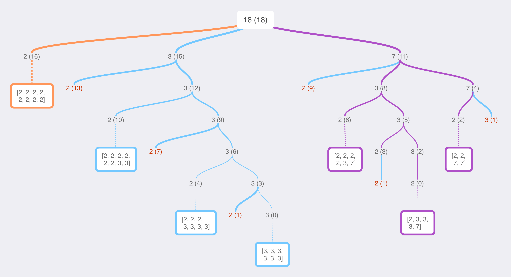

# Thinking process behind the algorithm

The basic idea is to break down the target until we find a path such that the remaining sum is 0. For the sample input `[2, 3, 6, 7], 7`, which requires us to find all possible combinations of `[2, 3, 6, 7]` such that their sum is `7`, we can visualize the process in the left diagram below. (The number in the parenthesis is the remaining sum).



At each node, we consider potential candidates that may help us satisfy the remaining sum. For instance, at `2 (5)`, `[6, 7]` are no longer viable candidates because they exceed 5. At each leaf, we either have a remaining sum of 0 (i.e. a viable solution), or a non-zero remaining sum with no potential candidates (for instance, no candidate can satisfy `2 (1)`).

Immediately, we can recognize an inefficiency in this algorithm: 3 different paths in this tree yield the same solution, `[2, 2, 3]` (ordering does not matter). To eliminate duplicate solutions, we can require subsequent candidates to be smaller than than the parent candidate (the `2-3-2` path would be equivalent to the `3-2-2` one).

At each node, therefore, all potential candidates are smaller than both the node itself and the remaining sum. In other words, `c <= min(parent_candidate, remaining_sum)`, where `c` is a potential candidate. Let's call the collection of all potential candidates a potential candidate set, unique to each node.

Another place we can optimize is when the potential candidate set has a size of 1. If that's the case, then the only way to reach a solution is that the remaining sum is a multiple of the potential candidate. For instance, if the potential candidate set is `(2)`, it can satisfy `2 (6)`, but not `2 (7)`.

Recognizing this, we can skip building out the tree once the potential candidate set has only one element. Consider the `2 (16)` node on the very left, for input `[7, 3, 2] 18`. We can avoid building out a branch of `2`s, decrementing the remaining sum by 2 at each turn, and reach the solution immediately.



The python implementation of the algorithm is as follows:

```python
class Solution:
    def combinationSum(self, candidates: List[int], target: int) -> List[List[int]]:
        candidates.sort()       # need to sort for calculating potential candidate set
        i_max = bisect.bisect_right(candidates, target)   # ignore candidates > target
        candidates = candidates[:i_max]
        return self.findcomb(candidates, parent=target, remaining_sum=target)

    def findcomb(self, candidates: List[int], parent: int, remaining_sum: int):
        """
        Input:      a list of candidates, a sum to find.
        Output:     all possibble solutions that candidates add up to the sum.
        """
        # ignore candidates greater than the parent, or greater than the remaining sum
        max_considered = bisect.bisect_right(candidates,
                                             min(parent, remaining_sum))
        ''' Base Cases '''
        if len(candidates[:max_considered]) == 0:
            return []   # no viable solution, if there's no viable candidate
        elif len(candidates[:max_considered]) == 1:
            the_candidate = candidates[0]
            if remaining_sum % the_candidate == 0:
                # if the remaining sum is a multiple of the candidate,
                # we find the multiple, then attach multiple * [candidate] to solution
                return [[the_candidate] * (remaining_sum // the_candidate)]
            else:
                # no viable solution, if there's only 1 candidate
                # and the remaining sum is not a multiple of the candidate
                return []
        ''' Intermediate cases '''
        else:   # more than 1 potential candidate
            ans = []
            for candidate in candidates[:max_considered]:
                next_remaining_sum = remaining_sum - candidate
                if next_remaining_sum == 0:
                    # no need for tree-building if the candidate
                    # can satisfy the remaining sum
                    ans.append([candidate])
                else:
                    paths = self.findcomb(candidates,
                                          parent=candidate,
                                          remaining_sum=next_remaining_sum)
                    self.append_paths(candidate, paths, ans)
            return ans

    def append_paths(self, parent, paths, ans):
        """
        Tracing out the paths by appending the parent node to the paths.
        """
        if paths != []:
            paths = [path + [parent] for path in paths]
            ans += paths

```
